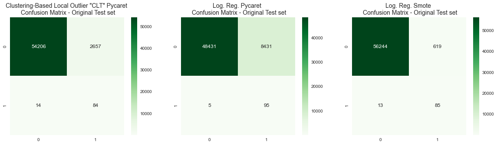
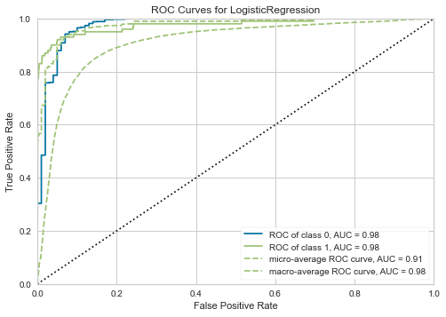

**Hello!**

Implementation of a Fraud Detection Model, using kaggle's dataset. Built in Python, using 3 different approaches:

* 1º - Pycaret Anomaly Detection (6 models tested):
- KNN;
- Isolation Forest;

* Pycaret Classifier (using 100% of our data);
* Logistic Regression with under-over samples (SMOTE technique).

**Conclusions**

The implementations made in this project show us that we have a trade-off when it comes to models. On the one hand, a model that can detect 95% of anomaly cases, but which attributes a huge volume of "non-fraud" transactions to fraud (false positive). On the other hand, a little prediction is lost using an under-over sample model (we achieved 87% success in detecting fraud), but we labeled 92% less reputable transactions as fraud, thus reducing our volume of false positives.

**`Some points about the models:`**

* The model with under-over sample was the best. There were only 619 false-positive and 13 false-negative observations;
* The pycaret classification model was better at solving frauds, however, there were 8431 cases of false positives, which can generate dissatisfaction among customers for having their cards blocked due to suspected fraud;
* The pycaret anomaly model managed to detect fraud as well as the under-over sample model, but it also had a high number of false positives (2657).

**`Important to say:`** Pycaret is a powerful prediction tool because with few lines of code it is possible to develop a model with great metrics. For models where there are no metrics designed and/or that need a quick solution, albeit a palliative one, pycaret will surely exceed expectations.

**`Personal note:`** I have been using pycaret in work projects. A scenario where we have few resources and a lot of demand. We are gaining agility with projects that need a quick response (due to our industry) or new customers, where there are still no defined metrics/goals.

Here you can see a comparing plot with the 3 approaches and a plot of pycaret's logistic regression AUC:

